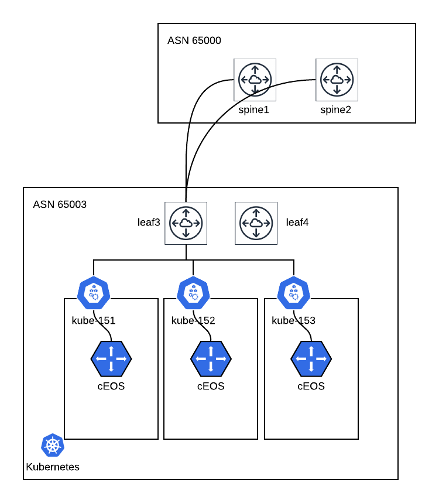

# Example deployment
## Topology

## Annotations

    kubectl annotate node kube152 arista/bgp-peer-ip-1="172.20.3.1" arista/bgp-local-as="65003"
    kubectl annotate node kube153 arista/bgp-peer-ip-1="172.20.3.1" arista/bgp-local-as="65003"

## Sample YAML File
[ceosr-init-0.7.yaml](ceosr-init-0.7.yaml)

## Sample leaf switch config
[lf3.config](lf3.config)
